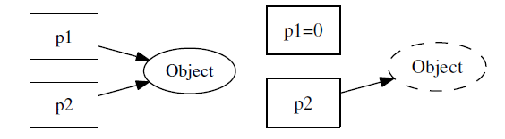
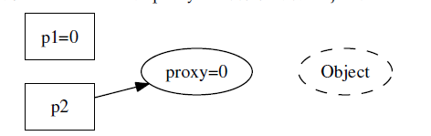
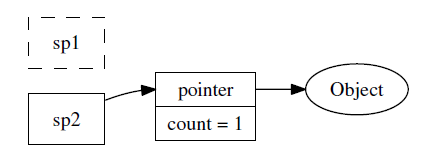
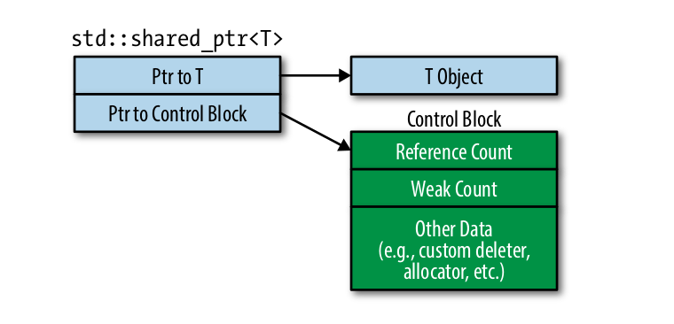

### Intro

编写线程安全的类不是难事，用同步原语（synchronization primitives）保护内
部状态即可。但是对象的生与死不能由对象自身拥有的mutex（互斥器）来保护。如
何避免对象析构时可能存在的race condition（竞态条件）是C++ 多线程编程面临的
基本问题，可以借助shared_ptr和weak_ptr完美解决。

### Data Race vs Race condition

非常相似的一组概念，但实则没有什么关系。因为定义完全不同。

A data race occurs when:
- two or more threads in a single process access the same memory location concurrently, and
- at least one of the accesses is for writing, and
- the threads are not using any exclusive locks to control their accesses to that memory.

A race condition or race hazard is 
- the condition of an electronics, software, or other system where 
- the system's substantive behavior is dependent on the sequence or timing of other uncontrollable events, 
- leading to unexpected or inconsistent results

No, they are not the same thing. 
- They are not a subset of one another. 
- They are also neither the necessary, nor the sufficient condition for one another.
- Many race conditions can be caused by data races, but this is not necessary.

这两个概念容易搞混是因为，data race的问题一般可以通过加锁解决(当然，atomic也是可以的)。race condition的问题也可以通过加锁解决。

data race有一个最明显的特征是：一定有多线程访问同一个变量，即同一块内存地址。而race conditon则不必须。所以，一个程序可能没有data race，但是它可能有race condtion.

看下面的代码：
```cpp
// No data race, but race condition exists.
// There is no any synchronization mechanism to protect critical region.
bool unsafe_transfer(std::atomic<int>& src, std::atomic<int>& dst, int money) {
  if (money < src) {
    std::this_thread::sleep_for(std::chrono::seconds(1));
    src -= money;
    dst += money;
    return true;
  } else {
    return false;
  }
}

bool safe_transfer(std::atomic<int>& src, std::atomic<int>& dst, std::mutex& mtx, int money) {
  std::scoped_lock lock(mtx);
  if (money < src) {
    std::this_thread::sleep_for(std::chrono::seconds(1));
    src -= money;
    dst += money;
    return true;
  } else {
    return false;
  }
}
```

非常经典的代码，前者没有data race，但是因为整个实现都是critial region，并且没有任何同步机制。所以，结果不确定。当然，我使用了```sleep```来让现象容易复现。即，程序是否异常取决于是否有一个线程可以先执行完，这是随机事件，导致结果不确定。

从这也可以看出来```atomic```的缺陷，可以保护单个变量，但是无法保护一段critical region.

### 对象的创建很简单

一个线程安全的class 应当满足以下三个条件
- 无论操作系统如何调度这些线程， 无论这些线程的执行顺序如何交织
（interleaving）
- 多个线程同时访问时，其表现出正确的行为
- 调用端代码无须额外的同步或其他协调动作

对象构造要做到线程安全，唯一的要求是在**构造期间不要泄露this指针**，即
- 不要在构造函数中注册任何回调
- 也不要在构造函数中把this 传给跨线程的对象
- 即便在构造函数的最后一行也不行

```cpp
// 不要这么做（Don't do this.）
class Foo : public Observer //
{
 public:
  Foo(Observable＊ s)
  {
    s->register_(this); // 错误，非线程安全
  }
  virtual void update();
};
```

对象构造的正确方法

```cpp
// 要这么做（Do this.）
class Foo : public Observer
{
 public:
  Foo();
  virtual void update();

  // 另外定义一个函数，在构造之后执行回调函数的注册工作
  void observe(Observable＊ s)
  {
    s->register_(this);
  }
};

Foo* pFoo = new Foo;
Observable* s = getSubject();
pFoo->observe(s); // 二段式构造，或者直接写s->register_(pFoo);
```

**二段式构造**——即构造函数+initialize()——有时会是好办法
- 这虽然不符合C++ 教条，但是多线程下别无选择。不暴露this指针，thread safe.
- 构造函数不必主动抛异常，调用方靠initialize() 的返回值来判断对象是否构造成
功，这能简化错误处理。即避免了ctor throw.

即使构造函数的最后一行也不要泄露this，因为Foo 有可能是个基类，基类先于
派生类构造，执行完Foo::Foo() 的最后一行代码还会继续执行派生类的构造函数，
这时most-derived class 的对象还处于构造中，仍然不安全

### 销毁太难

当一个对象能被多个线程同时看到时，那么对象的销毁时机就
会变得模糊不清，可能出现多种竞态条件(race condition)
- 在即将析构一个对象时，从何而知此刻是否有别的线程正在执行该对象的成员
函数？
- 如何保证在执行成员函数期间，对象不会在另一个线程被析构？
- 在调用某个对象的成员函数之前，如何得知这个对象还活着？它的析构函数会
不会碰巧执行到一半

由于dtor会销毁对象内部的mutex，导致后者无法起到保护内部状态的作用

```cpp
Foo::~Foo()
{
  MutexLockGuard lock(mutex_);
  // free internal state (1)
}

void Foo::update()
{ 
  MutexLockGuard lock(mutex_); // (2)
  // make use of internal state
}

// thread A
delete x;
x = NULL; // helpless

// thread B
if (x) {
x->update();
}
```

考虑如下调度顺序:
1. thread A先执行，拿到锁之后，调度
2. thread B后执行，条件判断成功(此时还未真正析构)，进入条件执行，调度
3. thread A接着执行，析构，指针置NULL
4. thread B接着执行，无效地址访问，coredump

二刷，这里我也算经验丰富了，我觉得主要问题在于
- 析构的时机不确定，这个是最大的问题。即，什么时候析构都不知道，让谁来析构？
- 不知道是因为在多线程并发环境下，线程A肯定不知道线程B的状态，如果共享了变量，另一个线程是否还在用，还要用多久，这些知识一无所知。

### 原始指针有何不妥

指向对象的原始指针（raw pointer）是坏的，尤其当暴露给别的线程时。因为**一个动态创建的对象是否还活着，光看指针是看不出来的**
通过raw pointer实现的observer不是线程安全的，根本原因就在于此

二刷：我觉得是缺乏原子操作的判断，即使当下看存在的，指针不为空。接着访问是可能就是非法访问，因为这个间隙，对象被释放了。

#### 空悬指针



- 线程A通过p1将对象销毁
- 线程B不知道，p2任然指向销毁对象，造成空悬指针

要想安全地销毁对象，最好在别人（线程）都看不到的情况下，偷偷地做。（这正是垃圾回收的原理，所有人都用不到的东西一定是垃圾。）

#### handle/body idiom(another layer of indirection)



一个解决空悬指针的办法是，引入一层间接性，让p1 和p2 所指的对象永久有效。通过proxy值来判断object对象是否存活<br>
当然对于proxy值的判断存在race condition

#### 一个更好的解决办法



引入引用计数，同时保证线程安全，也即智能指针的方案。

### 神器shared_ptr/weak_ptr

- shared_ptr 控制对象的生命期，强引用
- weak_ptr 不增加对象的引用次数，不控制对象的生命期，但是它知道对象是否还活着，弱引用
  - 如果对象还活着，那么它可以提升（promote）为有效的shared_ptr；如果对象已经死了，提升会失败，返回一个空的shared_ptr
  - 提升/lock()行为是线程安全的。这个主要是为了避免，上一秒有效，下一秒无效，提升失败。只能是判断有效+提升，整个操作是原子的。
- shared_ptr/weak_ptr 的“计数”在主流平台上是原子操作，没有用锁，性能不俗
- shared_ptr/weak_ptr 的线程安全级别与std::string 和STL 容器一样，即不是线程安全的

这里有一点要注意，weak_ptr支持弱引用，即不要求指向的对象有效，这个是合理的。raw pointer的问题在于，当指向对象无效时，不能判断是否有效，从而进一步访问导致程序coredump
weak_ptr提供了判断指向对象是否有效的方法，避免了raw pointer(一个动态创建的对象是否还活着，光看指针是看不出来的)
的缺点。并且，promote/lock行为又是线程安全的，这样当指向对象无效时，不去进一步访问，即可保证程序的运行正常。

C++ 里可能出现的内存问题大致有这么几个方面：
1. 缓冲区溢出（buffer overrun）
2. 空悬指针/野指针
3. 重复释放（double delete）
4. 内存泄漏（memory leak）
5. 不配对的new[]/delete
6. 内存碎片（memory fragmentation）

正确使用智能指针能很轻易地解决前面5个问题

1. 缓冲区溢出：用std::vector<char>/std::string 或自己编写Buffer class 来管理缓冲区，自动记住用缓冲区的长度，并通过成员函数而不是裸指针来修改缓冲区
2. 空悬指针/野指针：用shared_ptr/weak_ptr，这正是本章的主题
3. 重复释放：用scoped_ptr，只在对象析构的时候释放一次
4. 内存泄漏：用scoped_ptr，对象析构的时候自动释放内存
5. 不配对的new[]/delete：把new[] 统统替换为std::vector/scoped_array

需要注意一点：scoped_ptr/shared_ptr/weak_ptr 都是值语意，要么是栈上对象，或是其他对象的直接数据成员，或是标准库容器里的元素。几乎不会有下面这种
用法:
```cpp
shared_ptr<Foo>＊ pFoo = new shared_ptr<Foo>(new Foo);
// WRONG semantic
// value-like semantics, not pointer-like semantics.
```

### 再论shared_ptr的线程安全

这一小节比较重要，也是容易搞混的地方，即对于shared_ptr来说，到底哪些操作是thread safe，哪些不是。很重要。因为这容易引起误用，从而导致错误。

虽然我们借shared_ptr 来实现线程安全的对象释放，但是shared_ptr 本身不是100% 线程安全的
- 它的引用计数本身是安全且无锁的，
- 但对象的读写则不是，因为shared_ptr 有两个数据成员，读写操作不能原子化

#### shared_ptr的引用计数操作是线程安全的

即，多线程下所有和引用计数的操作是线程安全的。
- 比如，一个全局shared_ptr，此时ref count == 1
- 还有10个线程分分别进行了copy,那么在他们拷贝结束后，这个ref count == 11，肯定不会是别的值。
- 同时，local copy结束后，析构shared_ptr会减少引用计数，这个值也是正确的。

#### shared_ptr的读写操作不是线程安全的

先看一下shared_ptr的数据结构：



我们可以考虑如下操作:
- t0时刻：p2,p3分配对象。p1为空shared_ptr. 同时执行 p1 = p2; p2 = p3;
- t1时刻：p1的object ptr指向p2的object.
- t2时刻：p2的object ptr指向p3的object，同时p2 control block ptr指向p3的control block。此时因为p2的老control block中的引用计数变为0，对老object进行析构。
- t3时刻，p1完成control block ptr的赋值。但此时，原来p2的control block/object均已析构，此时造成p1为dangling pointer。

根本原因在于，shared_ptr的写操作不是线程安全的，其牵扯较多操作。
- 原始指针的变化。object/control block指针的变化
- 可能的析构操作。由于更新引用计数，可能会造成老对象的析构操作。
- 这多个操作均非事务执行，一旦多线程交替执行，会造成race condition.

1. 一个shared_ptr 对象实体可被多个线程同时读取
2. 两个shared_ptr 对象实体可以被两个线程同时写入，“析构”算写操作
3. 如果要从多个线程读写同一个shared_ptr 对象，那么需要加锁

```cpp
struct Foo {};

std::shared_ptr<Foo> foo_ptr;
MutexLock ptr_mtx;

void ReadOp(const std::shared_ptr<Foo>& ptr) {}
void WriteOp(std::shared_ptr<Foo>* ptr) {}

void Read() {
  std::shared_ptr<Foo> local_ptr;
  {
    MutexLockGuard mtx_guard(ptr_mtx);
    local_ptr = foo_ptr; // copy semantics is not heavy
  }
  ReadOp(local_ptr);
}

void Write() {
  std::shared_ptr<Foo> local_ptr;
  {
    MutexLockGuard mtx_guard(ptr_mtx);
    local_ptr = foo_ptr;
  }
  WriteOp(&local_ptr);
}
```

上面代码使用了local copy的方式，缩短了临界区，对local_ptr的读写本身不需要加锁。

果冻虾仁在[c++ 11 的shared_ptr多线程安全？](https://www.zhihu.com/question/56836057)中又做了进一步论述
- 情况1：多线程操作的就是同一个shared_ptr，写操作(改变指向)不是线程安全的。
- 情况2：多线程操作的是不同的shared_ptr，但都指向了一个object。这个没问题。这其实也是上面的local copy写法。使用了value-like semantics。
  - 注意，此时也只是改变指向是线程安全的。即smart pointer的赋值。
  - 如果要修改指向的对象，也是有问题的。除非指向的对象本身是线程安全的。

shared_ptr的线程安全性确实有点复杂，需要分情况，仔细讨论。

### shared_ptr技术与陷阱

#### make_shared vs direct use of new

[std::make_shared](https://en.cppreference.com/w/cpp/memory/shared_ptr/make_shared)中指出：
- std::shared_ptr<T>(new T(args...)) performs at least two allocations (one for the object T and one for the control block of the shared pointer), 
- while std::make_shared<T> typically performs only one allocation (the standard recommends, but does not require this; all known implementations do this).

同时，EMC中也指出：
- The size and speed advantages of std::make_shared vis-à-vis direct use of new stem
from std::shared_ptr’s control block being placed in the same chunk of memory
as the managed object. 
- When that object’s reference count goes to zero, the object is destroyed (i.e., its destructor is called). However, the memory it occupies can’t be released until the control block has also been destroyed, because the same chunk of dynamically allocated memory contains both

结合```shared_ptr```的数据结构，我们知道
- ```make_shared```将control block和object分配在一块内存上，且分配一次。
- ```direct use of new```则分配两次，不在同一个内存上。
- 上面的分配方式，或者说内存的组织结构，造成了他们之间性能的差异。
- ```make_shared```只分配一次，有时间上的性能收益。但是，control block和object分配在一起，也造成其空间上的损耗。
  - 如果weak_ptr的引用计数(weak count)不为0(ref count为0，weak count不增加ref count。即使promote失败可以接受，所以它的值和ref count并不同步)，此时object不能释放。因为control block不能释放(因为weak count不为0)，这也就导致了garbage存在。
  - 但如果使用direct use of new，ref count为0， weak count不为0。可以释放object，但是保存control block。因为物理上他们不在一起。

#### 意外延长对象的生命期

如果不小心遗留了一个拷贝，那么对象就永世长存了。
一个出错的可能是boost::bind，因为boost::bind 会把实参拷贝一份，如
果参数是个shared_ptr，那么对象的生命期就不会短于boost::function 对象

```
class Foo
{
void doit();
};
shared_ptr<Foo> pFoo(new Foo);
boost::function<void()> func = boost::bind(&Foo::doit, pFoo); // long life foo
```

#### 函数参数

因为要修改引用计数（而且拷贝的时候通常要加锁），shared_ptr 的
拷贝开销比拷贝原始指针要高，但是需要拷贝的时候并不多。多数情况下它可以以
**const reference** 方式传递.遵照这个规则，基本上不会遇到反复拷贝shared_ptr 导致的性能问题

```cpp
void save(const shared_ptr<Foo>& pFoo); // pass by const reference
void validateAccount(const Foo& foo);
bool validate(const shared_ptr<Foo>& pFoo) // pass by const reference
{
  validateAccount(＊pFoo);
// ...
}

那么在通常情况下，我们可以传常引用（pass by const reference）：
void onMessage(const string& msg)
{
  shared_ptr<Foo> pFoo(new Foo(msg)); // 只要在最外层持有一个实体，安全不成问题
  if (validate(pFoo)) { // 没有拷贝pFoo
    save(pFoo); // 没有拷贝pFoo
  }
}
```

#### 析构动作在创建时被捕获

这点我认为很重要的一个特性是，析构动作可以定制。

#### 析构所在的线程

对象的析构是同步的，当最后一个指向x 的shared_ptr 离开其作用域的时候，x 会同时在同一个线程析构。这个线程不一定是对象诞生的线程
这个特性是把双刃剑：如果对象的析构比较耗时，那么可能会拖慢关键线程的速度。

同时，我们可以用一个单独的线程来专门做析构，通过一个BlockingQueue<shared_ptr<void> > 把对象的析
构都转移到那个专用线程，从而解放关键线程。

#### 现成的RAII handle

- unique_ptr/shared_ptr 是管理资源的利器
- 需要注意避免循环引用，通常的做法是owner 持有指向child 的shared_ptr，child 持有指向owner 的weak_ptr。

### 对象池

这一小节是一个实验章节，会将前面讲到的知识点应用到一个具体案例中，通过case by case的形式，让大家真正的融会贯通，可谓是本章的精华。
在此，我先开宗明义的给出本小节的核心知识点(其实是换一个角度理解smart pointer，别开生面解惑也)

- SmartPointer固然有RAII的作用，但是它还有另外一个核心作用：即避免raw pointer无法判断一个块内存是否有效的缺点，在多线程编程时尤为重要。
- std::weak_ptr固然可以避免形成cylic reference，但是它还有另外一个核心作用：即避免std::shared_ptr意外延长对象生命周期的缺点，在多线程编程时尤为重要。

我在串到一起说一下，当我们进行多线程编程时，
1. 如果使用raw pointer，我们面临最大的问题就是，无法知道这个指针所指向的内存是否还有效，指针非空的断言肯定不行，因为这块地址可能已经重新分配了，
如果此时接着使用，会导致undefined behavior。
2. 故，我们引入shared_ptr，来保证这块地址在访问的时候，肯定是有效的，因为shared_ptr是强引用。这样看似已经很完美了，但如果
我们吹毛求疵，一块内存有其固有的生命周期，使用了shared_ptr之后，可能会延长它的固有生命周期。
3. 此时，我们引入weak_ptr，如果其生命周期已经结束，那就结束好了。同时，weak_ptr提供了我们这样的工具(promote)，让我们可以感知到这块内存已经失效，
那我们不再访问即可。
4. 即,我们可以使用shared_ptr来延长对象的生命周期，保证其在访问时的有效性，程序不coredump。也可以通过使用weak_ptr提供给我们的工具，判断一块内存的有效性，
来确定是否访问，一样可以保证程序不coredump。所以，核心是为了解决程序不coredump，而raw pointer无法解决这个问题。

补充一点，weak_ptr不能单独使用，需要和shared_ptr配合使用。

先给出一个公共结构
```cpp
class Stock {
 public:
  explicit Stock(const std::string& key) : key_(key) {}
  std::string GetKey() const { return key_; }

 private:
  std::string key_;
};
```

- version1: shared_ptr

```cpp
namespace version1 {

// shared_ptr
class StockFactory {
 public:
  using StockPtr = std::shared_ptr<Stock>;

  StockFactory() = default;

  StockFactory(const StockFactory&) = delete;
  StockFactory& operator=(const StockFactory&) = delete;

  StockPtr GetStock(const std::string& key);

 private:
  MutexLock mtx_;
  std::unordered_map<std::string, StockPtr> stock_factory_;
};

StockFactory::StockPtr StockFactory::GetStock(const std::string& key) {
  MutexLockGuard mtx_guard(mtx_);
  auto it = stock_factory_.find(key);
  if (it == stock_factory_.end()) {
    it->second = std::make_shared<Stock>(key);
    // do something with new stock
  }
  return it->second;
}

}  // namespace version1
```

这个版本的问题在于，StockPtr是强引用，导致map里面会一直存着这个stock，即使外部没有人使用，也会一致存在

- version2: weak_ptr

```cpp
namespace version2 {

// weak_ptr
class StockFactory {
 public:
  using StockPtr = std::weak_ptr<Stock>;

  StockFactory() = default;

  StockFactory(const StockFactory&) = delete;
  StockFactory& operator=(const StockFactory&) = delete;

  StockPtr GetStock(const std::string& key);

 private:
  MutexLock mtx_;
  std::unordered_map<std::string, StockPtr> stock_factory_;
};

StockFactory::StockPtr StockFactory::GetStock(const std::string& key) {
  std::shared_ptr<Stock> local_ptr;
  MutexLockGuard mtx_guard(mtx_);
  auto& wptr = stock_factory_[key];
  local_ptr = wptr.lock();
  if (!local_ptr) {
    local_ptr.reset(new Stock(key));
    wptr = local_ptr;
  }
  return local_ptr;
}

}  // namespace version2
```

这个版本解决了上一个版本的问题，如果外部的引用不存在，那么map中则不会存储这个版本。但是这个版本也会存在一个问题，
即map中的key还一直存在，虽然value(smart pointer)已经不存在了。chenshuo认为这也是某种程度的“内存泄露”

- version3: weak_ptr with this

```cpp
StockFactory::StockPtr StockFactory::GetStock(const std::string& key) {
  std::shared_ptr<Stock> local_ptr;
  MutexLockGuard mtx_guard(mtx_);
  auto& wptr = stock_factory_[key];
  local_ptr = wptr.lock();
  if (!local_ptr) {
    using namespace std::placeholders;
    local_ptr.reset(new Stock(key), std::bind(&StockFactory::StockDeleter, this, _1));
    wptr = local_ptr;
  }
  return local_ptr;
}

void StockFactory::StockDeleter(Stock* stock) {
  if (stock) {
    {
      MutexLockGuard mtx_guard(mtx_);
      stock_factory_.erase(stock->GetKey());
    }
    delete stock;
  }
}
```

这个版本通过析构回调的方式，解决了map中key的生命周期意外延长的问题。但是，这个版本有线程安全的问题，因为this是一个raw pointer。
StockFactory可能先析构了，此时程序会coredump

- version4: weak_ptr with enable_from_this

```cpp
namespace version4 {

// weak_ptr with shared_from_this
class StockFactory : public std::enable_shared_from_this<StockFactory> {
 public:
  using StockPtr = std::weak_ptr<Stock>;

  StockFactory() = default;

  StockFactory(const StockFactory&) = delete;
  StockFactory& operator=(const StockFactory&) = delete;

  StockPtr GetStock(const std::string& key);

 private:
  void StockDeleter(Stock*);

 private:
  MutexLock mtx_;
  std::unordered_map<std::string, StockPtr> stock_factory_;
};

StockFactory::StockPtr StockFactory::GetStock(const std::string& key) {
  std::shared_ptr<Stock> local_ptr;
  MutexLockGuard mtx_guard(mtx_);
  auto& wptr = stock_factory_[key];
  local_ptr = wptr.lock();
  if (!local_ptr) {
    using namespace std::placeholders;
    local_ptr.reset(new Stock(key), std::bind(&StockFactory::StockDeleter, shared_from_this(), _1));
    wptr = local_ptr;
  }
  return local_ptr;
}

void StockFactory::StockDeleter(Stock* stock) {
  if (stock) {
    {
      MutexLockGuard mtx_guard(mtx_);
      stock_factory_.erase(stock->GetKey());
    }
    delete stock;
  }
}

}  // namespace version4
```

这里通过shared_ptr来保证StockFactory访问时的有效性，但是这会带来另外一个问题，即这个对象的生命周期被延长了。我们的核心诉求是，程序在多线程环境下不
出现coredump，延长对象的生命周期可以，但是我们如果能感知到对象是否存在，不存在时，不进行访问，一样可以保证程序不出现coredump

- version5: weak_ptr with shared_from_this

```cpp
namespace version5 {

// weak_ptr with weak_from_this
class StockFactory : public std::enable_shared_from_this<StockFactory> {
 public:
  using StockPtr = std::weak_ptr<Stock>;

  StockFactory() = default;

  StockFactory(const StockFactory&) = delete;
  StockFactory& operator=(const StockFactory&) = delete;

  StockPtr GetStock(const std::string& key);

 private:
  static void StockDeleter(const std::weak_ptr<StockFactory>& wptr, Stock* stock);
  void RemoveStock(Stock* stock);

 private:
  MutexLock mtx_;
  std::unordered_map<std::string, StockPtr> stock_factory_;
};

StockFactory::StockPtr StockFactory::GetStock(const std::string& key) {
  std::shared_ptr<Stock> local_ptr;
  MutexLockGuard mtx_guard(mtx_);
  auto& wptr = stock_factory_[key];
  local_ptr = wptr.lock();
  if (!local_ptr) {
    using namespace std::placeholders;
    local_ptr.reset(new Stock(key), std::bind(&StockFactory::StockDeleter, weak_from_this(), _1));
    wptr = local_ptr;
  }
  return local_ptr;
}

void StockFactory::StockDeleter(const std::weak_ptr<StockFactory>& wptr, Stock* stock) {
  auto sptr = wptr.lock();
  if (sptr) {
    sptr->RemoveStock(stock);
  }
  delete stock;
}

void StockFactory::RemoveStock(Stock* stock) {
  if (stock) {
    MutexLockGuard mtx_guard(mtx_);
    stock_factory_.erase(stock->GetKey());
  }
}

}  // namespace version5
```

到此，version5解决了以上出现的所有问题。额外有一点需要注意，enable_from_this只能和shared_ptr即dynamic object配合使用，stack object则不行。示例如下，

```cpp
int main(void) {
  mymuduo::version1::StockFactory s1;
  mymuduo::version2::StockFactory s2;
  mymuduo::version3::StockFactory s3;
  auto s4 = std::make_shared<mymuduo::version4::StockFactory>();
  auto s5 = std::make_shared<mymuduo::version5::StockFactory>();
  return 0;
}
```

### 替代方案

chenshuo讲了很多方案，个人觉得实践中比较有用的是,**只创建，不销毁**的手法。我在工作中碰到的一般都是一个单例对象可能面临这样的并发读写，所以销毁不是一个非常重要的考虑点。
同时，这里我也引入我们自己经常使用的一个办法：[DoublyBufferedData](https://github.com/apache/incubator-brpc/blob/master/docs/cn/lalb.md#doublybuffereddata)这里给出
的是一个brpc version的实现，非常完备。下面我给出一个我们自己实现的简单版本，核心思想是避免繁重的mutex开销

```cpp
MutexLock cout_mtx;
struct Foo {
  int val{0};
};

void ReadFoo(const std::shared_ptr<Foo>& ptr) {
  MutexLockGuard mtx_guard(cout_mtx);
  std::cout << ptr->val << std::endl;
}

void WriteFoo(const std::shared_ptr<Foo>& ptr) {
  ++ptr->val;
  {
    MutexLockGuard mtx_guard(cout_mtx);
    std::cout << "Write is done." << std::endl;
  }
}

namespace version1 {

std::shared_ptr<Foo> global_ptr;
MutexLock ptr_mtx;

void Read() {
  std::shared_ptr<Foo> local_ptr;
  {
    MutexLockGuard mtx_guard(ptr_mtx);
    local_ptr = global_ptr; // copy semantics is not heavy
  }
  ReadFoo(local_ptr);
}

void Write() {
  std::shared_ptr<Foo> new_ptr = std::make_shared<Foo>();
  WriteFoo(new_ptr);
  {
    MutexLockGuard mtx_guard(ptr_mtx);
    global_ptr = new_ptr;
  }
}

}  // namespace version1

namespace version2 {

class FooMgr {
 public:
  FooMgr(const FooMgr&) = delete;
  FooMgr& operator=(const FooMgr&) = delete;

  static FooMgr& GetInstance() {
    static FooMgr foo_mgr;
    return foo_mgr;
  }

  void Read() const {
    auto local_ptr = dbd_[ver_];  // atomic var is not heavy
    ReadFoo(dbd_[ver_]);
  }

  void Write() {
    std::shared_ptr<Foo> new_ptr = std::make_shared<Foo>();
    WriteFoo(new_ptr);
    {
      // switch ab side
      auto new_ver = (ver_ + 1) % kABSide;
      dbd_[new_ver] = new_ptr;
      ver_ = new_ver;
    }
  }

 private:
  FooMgr() {
    for (int i = 0; i < kABSide; ++i) {
      dbd_[i] = std::make_shared<Foo>();
    }
  }
  ~FooMgr() = default;

 private:
  static constexpr int kABSide{2};
  std::shared_ptr<Foo> dbd_[kABSide];
  mutable std::atomic<int> ver_{0};
};

}  // namespace version2
```

### 心得与小结

- raw pointer暴露给多个线程往往会造成race condition 或额外的簿记负担
- 统一用shared_ptr/scoped_ptr 来管理对象的生命期，在多线程中尤其重要
- shared_ptr 是值语意，当心意外延长对象的生命期。例如boost::bind 和容器
都可能拷贝shared_ptr
- weak_ptr 是shared_ptr的好搭档，可以用作弱回调、对象池等
- 尽可能缩短临界区
