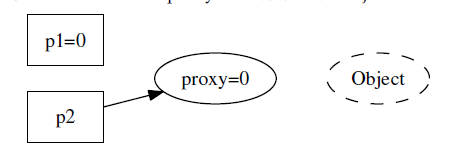
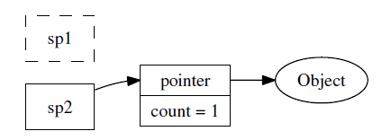

### Intro

编写线程安全的类不是难事，用同步原语（synchronization primitives）保护内
部状态即可。但是对象的生与死不能由对象自身拥有的mutex（互斥器）来保护。如
何避免对象析构时可能存在的race condition（竞态条件）是C++ 多线程编程面临的
基本问题，可以借助shared_ptr和weak_ptr完美解决。

### 对象的创建很简单

一个线程安全的class 应当满足以下三个条件
- 无论操作系统如何调度这些线程， 无论这些线程的执行顺序如何交织
（interleaving）
- 多个线程同时访问时，其表现出正确的行为
- 调用端代码无须额外的同步或其他协调动作

对象构造要做到线程安全，唯一的要求是在**构造期间不要泄露this指针**，即
- 不要在构造函数中注册任何回调
- 也不要在构造函数中把this 传给跨线程的对象
- 即便在构造函数的最后一行也不行

```cpp
// 不要这么做（Don't do this.）
class Foo : public Observer //
{
 public:
  Foo(Observable＊ s)
  {
    s->register_(this); // 错误，非线程安全
  }
  virtual void update();
};
```

对象构造的正确方法

```cpp
// 要这么做（Do this.）
class Foo : public Observer
{
 public:
  Foo();
  virtual void update();

  // 另外定义一个函数，在构造之后执行回调函数的注册工作
  void observe(Observable＊ s)
  {
    s->register_(this);
  }
};

Foo* pFoo = new Foo;
Observable* s = getSubject();
pFoo->observe(s); // 二段式构造，或者直接写s->register_(pFoo);
```

二段式构造——即构造函数+initialize()——有时会是好办法
- 这虽然不符合C++ 教条，但是多线程下别无选择
- 构造函数不必主动抛异常，调用方靠initialize() 的返回值来判断对象是否构造成
功，这能简化错误处理

即使构造函数的最后一行也不要泄露this，因为Foo 有可能是个基类，基类先于
派生类构造，执行完Foo::Foo() 的最后一行代码还会继续执行派生类的构造函数，
这时most-derived class 的对象还处于构造中，仍然不安全

### 销毁太难

当一个对象能被多个线程同时看到时，那么对象的销毁时机就
会变得模糊不清，可能出现多种竞态条件(race condition)
- 在即将析构一个对象时，从何而知此刻是否有别的线程正在执行该对象的成员
函数？
- 如何保证在执行成员函数期间，对象不会在另一个线程被析构？
- 在调用某个对象的成员函数之前，如何得知这个对象还活着？它的析构函数会
不会碰巧执行到一半

由于dtor会销毁对象内部的mutex，导致后者无法起到保护内部状态的作用

```cpp
Foo::~Foo()
{
  MutexLockGuard lock(mutex_);
  // free internal state (1)
}

void Foo::update()
{ 
  MutexLockGuard lock(mutex_); // (2)
  // make use of internal state
}

// thread A
delete x;
x = NULL; // helpless

// thread B
if (x) {
x->update();
}
```

考虑如下调度顺序:
1. thread A先执行，拿到锁之后，调度
2. thread B后执行，条件判断成功(此时还未真正析构)，进入条件执行，调度
3. thread A接着执行，析构，指针置NULL
4. thread B接着执行，无效地址访问，coredump

### 原始指针有何不妥

指向对象的原始指针（raw pointer）是坏的，尤其当暴露给别的线程时。因为**一个动态创建的对象是否还活着，光看指针是看不出来的**
通过raw pointer实现的observer不是线程安全的，根本原因就在于此

#### 空悬指针


- 线程A通过p1将对象销毁
- 线程B不知道，p2任然指向销毁对象，造成空悬指针

要想安全地销毁对象，最好在别人（线程）都看不到的情况下，偷偷地做。（这正是垃圾回收的原理，所有人都用不到的东西一定是垃圾。）

#### handle/body idiom(another layer of indirection)



一个解决空悬指针的办法是，引入一层间接性，让p1 和p2 所指的对象永久有效。通过proxy值来判断object对象是否存活<br>
当然对于proxy值的判断存在race condition

#### 一个更好的解决办法



引入引用计数，同时保证线程安全，也即智能指针的方案。

### 神器shared_ptr/weak_ptr

- shared_ptr 控制对象的生命期，强引用
- weak_ptr 不增加对象的引用次数，不控制对象的生命期，但是它知道对象是否还活着，弱引用
  - 如果对象还活着，那么它可以提升（promote）为有效的shared_ptr；如果对象已经死了，提升会失败，返回一个空的shared_ptr
  - 提升/lock()行为是线程安全的
- shared_ptr/weak_ptr 的“计数”在主流平台上是原子操作，没有用锁，性能不俗
- shared_ptr/weak_ptr 的线程安全级别与std::string 和STL 容器一样，即不是线程安全的

这里有一点要注意，weak_ptr支持弱引用，即不要求指向的对象有效，这个是合理的。raw pointer的问题在于，当指向对象无效时，不能判断是否有效，从而进一步访问导致程序coredump
weak_ptr提供了判断指向对象是否有效的方法，避免了raw pointer(一个动态创建的对象是否还活着，光看指针是看不出来的)
的缺点。并且，promote/lock行为又是线程安全的，这样当指向对象无效时，不去进一步访问，即可保证程序的运行正常。

C++ 里可能出现的内存问题大致有这么几个方面：
1. 缓冲区溢出（buffer overrun）
2. 空悬指针/野指针
3. 重复释放（double delete）
4. 内存泄漏（memory leak）
5. 不配对的new[]/delete
6. 内存碎片（memory fragmentation）

正确使用智能指针能很轻易地解决前面5个问题

1. 缓冲区溢出：用std::vector<char>/std::string 或自己编写Buffer class 来管理缓冲区，自动记住用缓冲区的长度，并通过成员函数而不是裸指针来修改缓冲区
2. 空悬指针/野指针：用shared_ptr/weak_ptr，这正是本章的主题
3. 重复释放：用scoped_ptr，只在对象析构的时候释放一次
4. 内存泄漏：用scoped_ptr，对象析构的时候自动释放内存
5. 不配对的new[]/delete：把new[] 统统替换为std::vector/scoped_array

### 再论shared_ptr的线程安全

虽然我们借shared_ptr 来实现线程安全的对象释放，但是shared_ptr 本身不是100% 线程安全的
- 它的引用计数本身是安全且无锁的，
- 但对象的读写则不是，因为shared_ptr 有两个数据成员，读写操作不能原子化

1. 一个shared_ptr 对象实体可被多个线程同时读取
2. 两个shared_ptr 对象实体可以被两个线程同时写入，“析构”算写操作
3. 如果要从多个线程读写同一个shared_ptr 对象，那么需要加锁

```cpp
struct Foo {};

std::shared_ptr<Foo> foo_ptr;
MutexLock ptr_mtx;

void ReadOp(const std::shared_ptr<Foo>& ptr) {}
void WriteOp(std::shared_ptr<Foo>* ptr) {}

void Read() {
  std::shared_ptr<Foo> local_ptr;
  {
    MutexLockGuard mtx_guard(ptr_mtx);
    local_ptr = foo_ptr; // copy semantics is not heavy
  }
  ReadOp(local_ptr);
}

void Write() {
  std::shared_ptr<Foo> local_ptr;
  {
    MutexLockGuard mtx_guard(ptr_mtx);
    local_ptr = foo_ptr;
  }
  WriteOp(&local_ptr);
}
```

上面代码使用了local copy的方式，缩短了临界区。

### shared_ptr技术与陷阱

#### 意外延长对象的生命期

如果不小心遗留了一个拷贝，那么对象就永世长存了。
一个出错的可能是boost::bind，因为boost::bind 会把实参拷贝一份，如
果参数是个shared_ptr，那么对象的生命期就不会短于boost::function 对象

```
class Foo
{
void doit();
};
shared_ptr<Foo> pFoo(new Foo);
boost::function<void()> func = boost::bind(&Foo::doit, pFoo); // long life foo
```

#### 函数参数

因为要修改引用计数（而且拷贝的时候通常要加锁），shared_ptr 的
拷贝开销比拷贝原始指针要高，但是需要拷贝的时候并不多。多数情况下它可以以
**const reference** 方式传递.遵照这个规则，基本上不会遇到反复拷贝shared_ptr 导致的性能问题

```cpp
void save(const shared_ptr<Foo>& pFoo); // pass by const reference
void validateAccount(const Foo& foo);
bool validate(const shared_ptr<Foo>& pFoo) // pass by const reference
{
  validateAccount(＊pFoo);
// ...
}

那么在通常情况下，我们可以传常引用（pass by const reference）：
void onMessage(const string& msg)
{
  shared_ptr<Foo> pFoo(new Foo(msg)); // 只要在最外层持有一个实体，安全不成问题
  if (validate(pFoo)) { // 没有拷贝pFoo
    save(pFoo); // 没有拷贝pFoo
  }
}
```

#### 析构动作在创建时被捕获

这点我认为很重要的一个特性是，析构动作可以定制。

#### 析构所在的线程

对象的析构是同步的，当最后一个指向x 的shared_ptr 离开其作用域的时候，x 会同时在同一个线程析构。这个线程不一定是对象诞生的线程
这个特性是把双刃剑：如果对象的析构比较耗时，那么可能会拖慢关键线程的速度。

同时，我们可以用一个单独的线程来专门做析构，通过一个BlockingQueue<shared_ptr<void> > 把对象的析
构都转移到那个专用线程，从而解放关键线程。

#### 现成的RAII handle

- unique_ptr/shared_ptr 是管理资源的利器
- 需要注意避免循环引用，通常的做法是owner 持有指向child 的shared_ptr，child 持有指向owner 的weak_ptr。
