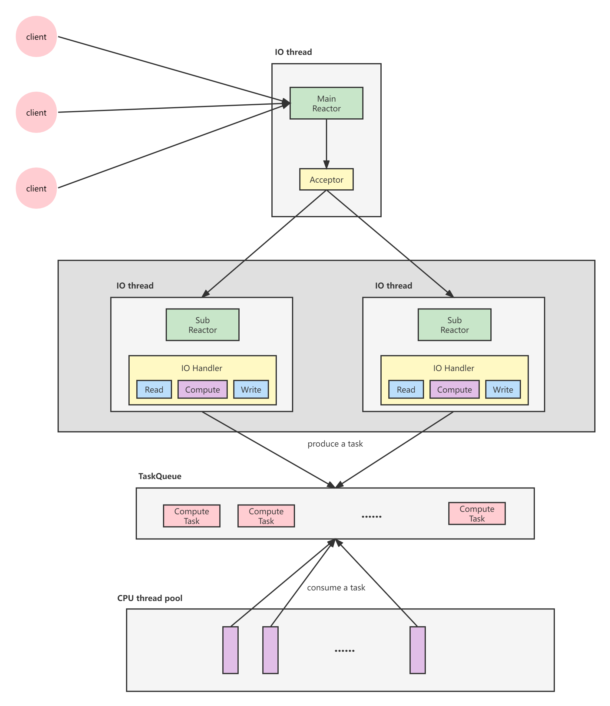

### Intro

本章总结了一两种常用的线程模型，归纳了进程间通信与线程同步的最佳实践，以期用简单规范的方式开发功能正确、线程安全的多线程程序

### 进程与线程

chenshuo将进程比作人，将独立的address space比作memory，对于分布式系统当中的一些功能，有了拟人化的理解
- 容错：万一有人突然挂了
- 扩容：新人突然加进来
- 负载均衡：把甲的活挪给乙做
- 退休：甲要修复bug，先别给他派活

线程的特点是共享地址空间，从而可以高效地共享数据。一台机器上的多个进程能高效地共享代码段（操作系统可以映射为同样的物理内存），但不能共享数据。
如果多个进程大量共享内存，等于是把多进程程序当成多线程来写，掩耳盗铃。

这里结合我们初代的推荐系统，彼时通过共享内存的方式支持索引，来达到共享数据的目的。一个cpu挂一个进程，固然代码好写也高效，但经常出现死锁，不就是这个问题嘛。所以后来，大家意识到这种设计的不足，才做了服务化。

chenshuo关于多线程的观点如下：
>"多线程"的价值，我认为是为了更好地发挥多核处理器（multi-cores）的效能。在单核时代，多线程没有多大价值.
Alan Cox 说过："A computer is a state machine.Threads are for people who can’t program state machines.
如果只有一块CPU、一个执行单元，那么确实如Alan Cox 所说，按状态机的思路去写程序是最高效的.

### 单线程服务器的常用编程模型

chenshuo在这里只提到了一种模型，就是Reactor。其具体概念如下：

>The reactor design pattern is an event handling pattern for handling service requests delivered concurrently to a service handler by one or more inputs. The service handler then demultiplexes the incoming requests and dispatches them synchronously to the associated request handlers.

这句话给我们如下的信息
- 是什么：一种设计模式(对于常见问题的通用、可复用的解决办法)，基于事件驱动编程范式下的一种通用做法(经过精心设计的fsm)
- 具体使用场景：并发场景下，处理多组io events

根据其使用场景，很容易锁定I/O Multiplexing，同时，又是event handling pattern，很明显就是基于select/poll/epoll fsm精心设计的一种模式。实际当中是通过epoll来实现
简而言之，Reactor是一种基于I/O Multiplexing和事件驱动的设计模式，主要用来(并发)处理多路低速IO设备。

具体到Reactor的实现，主要是使用"non-blocking IO + IO multiplexing",程序的基本结构是一个事
件循环（event loop），以事件驱动（event-driven）和事件回调的方式实现业务逻辑。

```cpp
/*event-loop*/
while(!done) {
/* Read the next incoming event. Usually this is a blocking function. */
    EVENTS event = readEventFromMessageQueue();

    /* Switch the state and the event to execute the right transition. */
    switch (state)
    {
      case ST_RADIO:
        switch (event)
        {
          case EVT_MODE:
            /* Change the state */
            state = ST_CD;
            break;
          case EVT_NEXT:
            /* Increase the station number */
            stationNumber++;
            break;
        }
        break;

      case ST_CD:
        switch (event)
        {
          case EVT_MODE:
            /* Change the state */
            state = ST_RADIO;
            break;
          case EVT_NEXT:
            /* Go to the next track */
            trackNumber++;
            break;
        }
        break;
    }
}

```

### 多线程服务器常用的编程模型

- one thread per connection
- thread pool
- one loop per thread(multi-reactor)
- Leader/Follower

chenshuo这里的建议是使用第三种，即multi-reactor。下面详细说一下这个模式

此种模型下，程序里的每个IO 线程有一个event loop （或者叫Reactor），用于处理读写和定时事件（无论周期性的还是单次的），代码框架跟之前一样。

libev的作者说：
>One loop per thread is usually a good model. Doing this is almost never
wrong, sometimes a better-performance model exists, but it is always a
good start.

这种模式的好处有
- 线程数目固定，可以在程序启动时设置好。不会频繁的创建与销毁
- 可以很方便的在线程之间调配负载。比如io thread和cpu thread个数
- IO 事件发生的线程是固定的，同一个TCP 连接不必考虑事件并发

同时既有计算，又有IO的服务，可以引入线程池来完成计算部分的工作。



### 进程间通信只用TCP

常见的IPC如下：
- pipe
- shared memory
- posix mq
- singal
- socket

关于IPC的选择，chenshuo的观点如下：
>进程间通信我首选Sockets（主要指TCP，我没有用过UDP，也不考虑Unixdomain 协议），其最大的好处在于：
可以跨主机，具有伸缩性。反正都是多进程了，如果一台机器的处理能力不够，很自然地就能用多台机器来处理。把进程分散到同一
局域网的多台机器上，程序改改host:port 配置就能继续用。相反，前面列出的其他IPC 都不能跨机器10，这就限制了scalability。

TCP socket具有如下优点：
- 全双工(对比pipe)
- 系统自动回收
- tcp port由一个进程独占，防止程序重复启动
- 两个进程通过TCP 通信，如果一个崩溃了，操作系统会关闭连接，另一个进程
几乎立刻就能感知，可以快速failover。应用层只能依赖心跳
- 可记录，可重现

当然，TCP socket也存在一些缺点：
- 有marshal/unmarshal的开销
- 共享内存效率最高

chenshuo这里也建议，即使单机，也没有必要为了一点性能的提升，而使用共享内存。按照我自己的经验来看，可不是这样，比如推荐的请求，通常网络包非常大，网络开销的节省通常会带来显著的性能收益。
共享内存的问题在于，代码不好写，容易死锁。并且只能是单机，如果使用，意味着不同的服务有耦合。

关于长短连接的选择，chenshuo建议只使用长连接，原因如下：
- 一是容易定位分布式系统中的服务之间的依赖关系
  - server side: ```netstat -tpna | grep :port```找出client port
  - client side: ```lsof -i:port```找出客户端进程
- 二是通过接收和发送队列的长度也较容易定位网络或程序故障
  - ```netstat -tn```

### 多线程服务器的适用场合

这里先给出chenshuo整体的观点：
- 分布式系统的软件设计和功能划分一般应该以"进程"为单位
- 从宏观上看，一个分布式系统是由运行在多台机器上的多个进程组成的，进程之间采用TCP 长连接通信。
- 本章讨论分布式系统中单个服务进程的设计方法。我提倡用多线程，并不是说把整个系统放到一个进程里实现，而是
指功能划分之后，在实现每一类服务进程时，在必要时可以借助多线程来提高性能
- 对于整个分布式系统，要做到能scale out，即享受增加机器带来的好处

开发服务端程序的一个基本任务是处理并发连接，现在服务端网络编程处理并发连接主要有两种方式
- 当"线程"很廉价时
  - 一台机器上可以创建远高于CPU 数目的"线程"。
  - 这时一个线程只处理一个TCP 连接（甚至半个），通常使用阻塞IO(至少看起来如此)
  - 例如，Python gevent、Go goroutine、Erlang actor。这里的"线程"由语言的runtime 自行调度，与操作系统线程不是一回事
- 当线程很宝贵时
  - 一台机器上只能创建与CPU 数目相当的线程
  - 这时一个线程要处理多个TCP 连接上的IO，通常使用非阻塞IO 和IO multiplexing
  - libevent、muduo、Netty。这是原生线程，能被操作系统的任务调度器看见

关于线程的理解，这里我多说一点。首先，不得不说的是，chenshuo这本书写于2012年，并且这是一本偏向于应用的书籍(对比apue/unp这种手册)，放在2022年的今天，重读起来发现任然不过时，并且其所讲的核心知识点，任然是广大linux cpp开发者所必备的技能。其次，我们来说下线程这个东西。

"廉价的线程"用目前的术语来讲，说的是协程(coroutine/fiber这一类)。但其实，这个概念具备一定的迷惑性。因为看起来它好像和进程，线程均为kernel提供。但其实不是，chenshuo讲的也很清楚，这个东西
kernel感知不到，完全是语言层面的产物。

对于这个概念的理解，我倾向于用folly当中关于fiber的描述来理解：
>Fibers (or coroutines) are lightweight application threads. Multiple fibers can be running on top of a single system thread. Unlike system threads, all the context switching between fibers is happening explicitly. Because of this every such context switch is very fast (~200 million of fiber context switches can be made per second on a single CPU core).

很明显，folly将coroutines/fibers理解为lightweight application threads，有别于system threads，前者由语言层面进行调度。这个东西真正的好处是，虽然还是异步框架(本质是异步阻塞)，但是
代码写起来像是同步代码。这里主要是为了优化之前的异步框架，即异步非阻塞，这种通常需要写回调，代码不好写，容器出错。

我们可以看到2022年的当下，目前主流的rpc开发框架所支持的方式，baidu的brpc，tx的trpc采用了异步阻塞(即协程)的方式，具体支持了bthread/fiber这样的组件。搜狗的workflow则还是保持了之前异步非阻塞(即回调)的方式。

一个由多台机器组成的分布式系统必然是多进程的（字面意义上），因为进程不能跨OS 边界。在这个前提下，我们把目光集中到一台机器，如果要在一台多核机器上提供一种服务或执行一个任务，可用的
模式有：
- model1: 运行一个单线程的进程(不能发挥多核的作用)
- model2: 运行一个多线程的进程(多线程不好写)
- model3: 运行多个单线程的进程
  - 3a: 简单的把model1运行多份，没有主从
  - 3b: master + slave
- model4: 运行多个多线程的进程(被人鄙视，无意义，既没有体现多核的优势，反而增大了难度)

chenshuo所推荐的是model2 and model3，这两个的优点是，都可以利用多核。model2线程通信容易，但是代码不好写(线程同步)。model3代码好写，但是进程通信不方便。
进一步，chenshuo讨论了什么时候该用model2，什么时候该用model3，即一个程序什么时候应该是多线程的。从功能上讲：**没有什么是多线程能做到而单线程做不到的，反之亦然，都是状态机嘛**

Paul E. McKenney 在《Is Parallel Programming Hard, And, If So, What Can You
Do About It?》17 第3.5 节指出
>As a rough rule of thumb, use the simplest tool that will get the job done.

所以，当我们考虑到底使用model2 or model3时，一定要看场景，比如下面的情形：
- 如果要偶尔压缩1GB 的文本文件，预计运行时间是20s，那么起一个进程去做
是合理的，因为进程启动和销毁的开销远远小于实际任务的耗时。
- 如果要经常压缩500kB 的文本数据，预计运行时间是10ms，那么每次都起进程
似乎有点浪费了，可以每次单独起一个线程去做。
- 如果要频繁压缩10kB 的文本数据，预计运行时间是200μs，那么每次起线程似
乎也很浪费，不如直接在当前线程搞定。也可以用一个线程池，每次把压缩任
务交给线程池，避免阻塞当前线程（特别要避免阻塞IO 线程）

#### 必须使用单线程的场合

1. 程序可能会fork
2. 限制程序的CPU 占用率

**一个设计为可能调用fork的程序必须是单线程的**，多线程程序不是不能调用fork(2)，而是这么做会遇到很多麻烦

一个程序fork(2) 之后一般有两种行为：
- 立刻执行exec()，变身为另一个程序。例如shell 和inetd；又比如lighttpd
fork() 出子进程，然后运行fastcgi 程序。或者集群中运行在计算节点上的负责
启动job 的守护进程（即我所谓的“看门狗进程”）。
- 不调用exec()，继续运行当前程序。要么通过共享的文件描述符与父进程通信，
协同完成任务；要么接过父进程传来的文件描述符，独立完成工作，例如20 世
纪80 年代的Web 服务器NCSA httpd。

**单线程程序能限制程序的CPU占用率**这个很容易理解，比如在一个8 核的服
务器上，一个单线程程序即便发生busy-wait（无论是因为bug，还是因为overload），
占满1 个core，其CPU 使用率也只有12.5%. 18 在这种最坏的情况下，系统还是有
87.5% 的计算资源可供其他服务进程使用。

对于一些辅助性的程序，如果它必须和主要服务进程运行在同一台机器的话
（比如它要监控其他服务进程的状态），那么做成单线程的能避免过分抢夺系统的计算
资源。比方说如果要把生产服务器上的日志文件压缩后备份到NFS 上，那么应该使
用普通单线程压缩工具（gzip/bzip2）。否则，会影响关键任务。

#### 单线程程序的优缺点

- 优点：简单，代码好写。
- 缺点：对于event-loop而言，non-preemptive可能导致优先级反转，所以考虑优先级的情形时，需要支持强占的能力(多线程可以解决这个问题)

chenshuo认为，多线程程序无性能优势，这里一定要注意，他对比的是多线程程序和多进程单线程的能力。即都支持并发的前提下，多线程不比多进程有性能优势。

#### 适用多线程程序的场景

chenshuo认为多线程的适用场景是
>提高响应速度，让IO 和“计算”相互重叠，降低latency。虽然多线程不能提高绝对性能，但能提高平均响应时间。

先说下怎么理解这句话，对于计算密集型服务，多线程不能提高性能，那么吞吐显然也不能提高。但是为什么能提高平均响应时间？我们看一个demo

- 假设有一个耗时的计算服务，用单线程算需要latency = 0.8s。此时throughout = 1.25qps
- 在一台8核的机器上，我们可以启动8个线程一起对外服务（如果内存够用，启动8个进程也一样）
  - 这样完成单个计算仍然要latency = 0.8s，average latency = 0.8s
  - 但是由于这些进程的计算可以同时进行，此时throughout = 1.25 * 8 = 10qps
- 假如改用并行算法，用8个核一起算，理论上如果完全并行，加速比高达8
  - 单个计算latency = 0.1s，首次请求的响应时间降低了很多，平均响应时间average latency = 0.36s
  - throughout = 10qps，吞吐没有变。

再举一个例子，如果要在一台8核机器上压缩100个1GB的文本文件，每个core的处理能力为200MB/s。
那么“每次起8个进程，每个进程压缩1 个文件”与“依次压缩每个文件，每个文件用8个线程并行压缩”这两种方式的总耗时相当，因为
CPU 都是满载的。但是第2 种方式能较快地拿到第一个压缩完的文件，也就是首次响应的延时更小

一个程序要做成多线程，大致满足：

- 支持多核
- 线程间有数据共享，且共享数据可以修改。否则shared memory+多进程也可以
- 提供非均质服务。即事件的响应有优先级差异，可以找专门的线程支持高优事件，防止优先级反转
- latency和throughout一样重要，即不是逻辑简单的IO bound或者CPU bound。换言之，程序要有相当的计算量。
- 利用异步操作。比如logging，无论往本地log file写还是向远端log server发送消息，都不应该阻塞critical path
- 能scale up。一个好的多线程程序应该能享受增加CPU数目带来的好处。
- 具有可预测的性能。chenshuo的表达我不是很理解，我说下我的理解，即和scale up一致，每个cpu的处理能力应该能量化。
- 使用多线程后可以有效的划分责任与功能。即要求服务具备一定的复杂性，任务可拆解。使用多线程后，让每个线程的逻辑比较简单，任务单一。

chenshuo接下来给了一个demo，用来阐明线程model的选择
>假设要管理一个Linux 服务器机群，这个机群里有8个计算节点，1个控制节点。
机器的配置都是一样的，双路四核CPU，千兆网互联。现在需要编写一个简单的机
群管理软件（参考LLNL 的SLURM 20），这个软件由3个程序组成：

1. 运行在控制节点上的master，这个程序监视并控制整个机群的状态。
2. 运行在每个计算节点上的slave，负责启动和终止job，并监控本机的资源。
3. 供最终用户使用的client 命令行工具，用于提交job。

选型依据如下：
- slave是典型的watch dog，所以选择model1，即单进程单线程
- master的选型有如下考虑：
  - 独占一个节点，如果是model1，那么浪费87.5%的资源
  - master主要指标不是throughout，而是latency，要尽快响应各种事件。所以，model2好于model3
  - 集群的状态可以放在内存中，可读可写，所以model2在通信上好于model3
  - master监控的事件有优先级，一个奔溃的程序需要优先处理，如果使用单线程，会出现优先级反转。
  - master作为管理节点，log至关重要，同时不能阻塞crital path，所以需要单独的线程支持异步操作。
  - 总结：io bound + cpu bound服务，model2是合适的。其根本依据是io bound需要单独的线程，不阻塞critical path(cpu bound)

  #### 线程的分类

  一个多线程服务程序中的线程大致可分为3类：
  - IO线程: 这类线程的主循环是IO multiplexing，阻塞地等在select/poll/epoll_wait系统调用上。注意：从上层来看是阻塞的(从底层看fd，是非阻塞的)
  - 计算线程：这类线程的主循环是blocking queue，阻塞地等在condition variable上。这类线程一般位于thread pool中。这种线程通常不涉及IO，一般要避免任何阻塞操作。注意：从计算上来看，是非阻塞的。
  - 第三方库所用的线程：比如logging/data base connection
  
### Q & A

1. Linux能同时启动多少个线程？

对于32-bit linux，进程的地址空间4GB，用户态能访问3GB左右。一个线程的默认栈大小10MB，所以一个进程大约最多能同时启动300个线程。
300个左右是上线，因为程序的其他部分(代码段，数据段，堆，动态库)同样需要占用内存。

2. 多线程能提高并发度嘛？

如果指的是"并发连接数"，则不能。
由问题1可知，假如单纯采用thread per connection模型，那么并发连接数最多300。单Reactor处理并发的能力在几千到上万左右，多Reacator则更强。

3. 多线程能提高吞吐嘛？

对于计算密集型服务，不能。在适用多线程程序适用的场景已经讨论过，多线程程序可以提升latency，但是不能提升throughout.

4. 多线程程序能降低响应时间嘛？

如果设计合理，充分利用多核资源的话，可以。在突发请求时，效果尤为明显。
我们看到chenshuo在设计sudoku这个服务时，即使采用多线程，对于IO处理并没有并发，还是一个单线程。计算分派到线程池里去做。
这么做是因为IO handle不怎么耗时，没有必要在这里就开始并发。其实Reactor的设计也是这个思路。

5. 多线程程序如何让IO和计算相互重叠，降低latency?

这个问题对我个人而言，具有比较强的现实意义，因为我目前所负责的推荐服务，很多模块都是这样的特性，比如粗排，精排。都是在大IO的前提下，又有着相当的计算量。
这个问题的核心解决办法是，不要让IO阻塞计算，即不要阻塞critical path.
chenshuo举了logging的例子，同步写，肯定会阻塞。设计一个单独的logging thread，来负责IO。cpu thread遇到logging操作时，将数据发给blocking-queue(not heavy)，同时logging thread来负责消费。同理上报也是一样的思路，均是通过异步操作来实现。