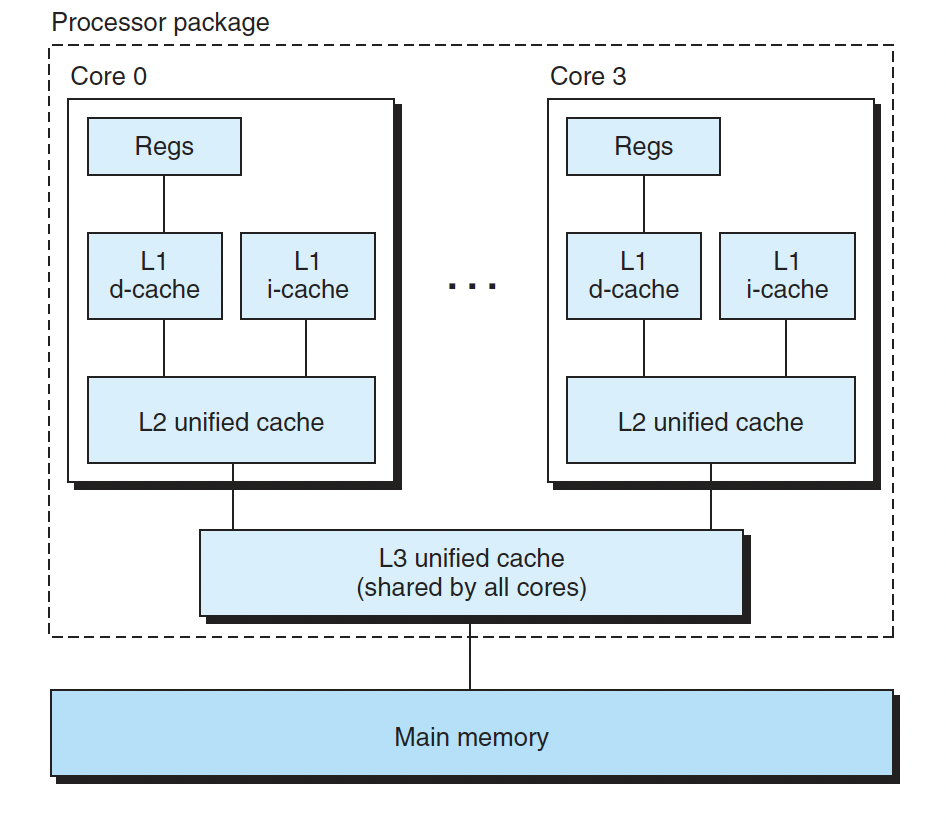

### Intro

本章总结了多线程编程的常用技术，以及一些最佳实践。

### 不同之处

学习多线程编程面临的最大的思维方式的转变有两点：
- 当前线程可能随时会被切换出去，或者说被抢占（preempt）了。
- 多线程程序中事件的发生顺序不再有全局统一的先后关系

在单CPU 系统中，理论上我们可以通过记录CPU 上执行的指令的先后顺序来
推演多线程的实际交织（interweaving）运行的情况。

在多核系统中，多个线程是并行执行的，我们甚至没有统一的全局时钟来为每个事件编号。在没有适当同步的情况
下，多个CPU 上运行的多个线程中的事件发生先后顺序是无法确定的。

多线程程序的正确性不能依赖于任何一个线程的执行速度，不能通过原地等待
（sleep()）来假定其他线程的事件已经发生，而**必须通过适当的同步**来让当前线程能看到其他线程的事件的结果

### 基本线程原语的选用

本小节给出Posix threads API的一些使用建议：

- 常用的Pthreads函数
- 2个：线程创建和等待结束
- 4个：mutex的创建，销毁，加锁，解锁
- 5个：condition创建，销毁，等待，通知，广播
- 更常使用的是更高层的封装，比如TheadPool, CountdDownLatch
- 酌情使用的Pthreads函数
- pthread_once: 负责多线程的初始化
- pthread_key*: 可以直接使用__thread，本质是提供ThreadLocal storage
- 不推荐使用的Pthreads函数
- pthread_rwlock: chenshuo认为这个锁有可能降低性能，待进一步确定。
- sem*: 和条件变量重合
- pthread_cancel(pthread_kill): 意味着设计出了问题。

对于多线程系统编程，难点不在于学习线程原语，而在于学习如何设计并实现**线程安全**且**高效**的程序。

### c/c++系统库的线程安全性

这一小节，除了学习系统库的线程安全性，我认为chenshuo强调了一个很重要的点就是，对于系统设计者，他们关心的到底是什么？chenshuo这里强调了memory model

>对于标准而言，关键的不是定义线程库，而是规定内存模型（memory model）。特别是规定一个线程对某个共享变量的修改何时能被其他线程看到，这称为内存序（memory ordering）或者内存能见度（memory visibility）

下面我们先简单过一下memory model及其相关概念

#### Memory model

wikipedia给出如下定义

>In computing, a memory model describes the interactions of threads through memory and their shared use of the data.

wiki的解释非常具体(对比cppreference)，简单来说就是约定好线程对于共享数据交互时的行为。那么具体是怎么约定的呢？wiki又进一步给出memory model和编译器优化行为的关系

>A memory model allows a compiler to perform many important optimizations.Compiler optimizations like loop fusion move statements in the program, which can influence the order of read and write operations of potentially shared variables. Changes in the ordering of reads and writes can cause race conditions. 

上面这一段解释说的很明白，memory model允许编译器优化代码的读写指令顺序，而后者的改变可能会导致race condition。注意这里的强调的是可能，因为不是所有读写指令都会影响共享变量，也不是所有影响共享变量的读写指令都会导致race condition。所以memory model本身允许编译器进行代码并没有问题，只是它也需要提供对应的同步工具。

我们接着看wiki给出的说明:

- The memory model specifies synchronization barriers that are established via special, well-defined synchronization operations such as acquiring a lock by entering a synchronized block or method. 
- The memory model stipulates that changes to the values of shared variables only need to be made visible to other threads when such a synchronization barrier is reached. 

这一部分说明memory model提供了barrier工具来进行线程间的同步，同时memory model也约定了同步工具的语义，即当我们使用这些同步工具时，对于共享变量的修改必须对所有线程可见。从下面这张图来说，Core 0更新了shared var，在同步L1/L2 cache的基础上，必须强制同步L3 cache.



我们最后看一下这一部分的总结：

>These (memory model)semantics then give optimizing compilers a higher degree of freedom when applying optimizations: the compiler needs to make sure only that the values of (potentially shared) variables at synchronization barriers are guaranteed to be the same in both the optimized and unoptimized code. In particular, reordering statements in a block of code that contains no synchronization barrier is assumed to be safe by the compiler.

这里强调到，memory model首先给了编译器非常大的自由度，让其可以进行代码优化。其次，也约定了编译器的优化限制，即对于共享变量读写指令的优化，必须保证其对于其余线程的可见性。

#### Memory ordering

wikipedia给出如下定义

- Memory ordering describes the order of accesses to computer memory by a CPU. The term can refer either to the memory ordering generated by the compiler during compile time, or to the memory ordering generated by a CPU during runtime.
- In modern microprocessors, memory ordering characterizes the CPU's ability to reorder memory operations – it is a type of out-of-order execution. Memory reordering can be used to fully utilize the bus-bandwidth of different types of memory such as caches and memory banks.
- On most modern uniprocessors memory operations are not executed in the order specified by the program code. In single threaded programs all operations appear to have been executed in the order specified, with all out-of-order execution hidden to the programmer – however in multi-threaded environments (or when interfacing with other hardware via memory buses) this can lead to problems. To avoid problems, memory barriers can be used in these cases.

wiki的解释分了3个层次，层层递进。首先，给出memory ordering的朴素定义，即访存指令的顺序。其次，指出在当下的微处理时代，memory ordering从侧面反映了cpu对于访存指令重排序的能力，即指令重排。这个能力使得cpu可能最大程度的利用总线来提升数据交换的效率。最后，指出了在多线程环境下，指令重排可能会导致为题，但是内存屏障可以解决这个问题。

memory ordering和momory model的关系在于，后者赋予了编译器前者的能力。如果memory model不允许编译器进行优化，那么指令重排也无法发挥作用。

#### Memory barrier

wikipedia给出如下定义

- A memory barrier, also known as a membar, memory fence or fence instruction, is a type of barrier instruction that causes a central processing unit (CPU) or compiler to enforce an ordering constraint on memory operations issued before and after the barrier instruction. This typically means that operations issued prior to the barrier are guaranteed to be performed before operations issued after the barrier.
- Memory barriers are necessary because most modern CPUs employ performance optimizations that can result in out-of-order execution. This reordering of memory operations (loads and stores) normally goes unnoticed within a single thread of execution, but can cause unpredictable behaviour in concurrent programs and device drivers unless carefully controlled. The exact nature of an ordering constraint is hardware dependent and defined by the architecture's memory ordering model. Some architectures provide multiple barriers for enforcing different ordering constraints.

wiki从两个角度来说，其一，内存屏障的作用，即保证在barrier之前的指令执行完了之后，才会执行之后的指令。很明显，这会避免指令重排，起码对于barrier前后的两条指令是这样。其二，强调了内存屏障的必要性，这主要是因为在并发编程环境下，如果不提供屏障工具会导致race condition.

memory barrier和memory model的关系在于，前者是后者提供的工具，来保证在并发编程环境下程序的正确性。

#### std::memory_order

下面我们来简单过一下cpp std::memory_order

When a thread reads a value from a memory location, it may see the initial value, the value written in the same thread, or the value written in another thread. See std::memory_order for details on the order in which writes made from threads become visible to other threads.

很明显，std::memory_barrier约定了多线程对于共享变量的写操作，何时可以被其余线程看见。我们可以认为他约定了指令重排的能力，即实现了memory barrier的能力。

下面我们结合std::memory_order_acquire以及memory_order_release讲一个例子，我们先看一下这两个memory order
- memory_order_acquire:A load operation with this memory order performs the acquire operation on the affected memory location: no reads or writes in the current thread can be reordered before this load. All writes in other threads that release the same atomic variable are visible in the current thread (see Release-Acquire ordering below)
- memory_order_release:A store operation with this memory order performs the release operation: no reads or writes in the current thread can be reordered after this store. All writes in the current thread are visible in other threads that acquire the same atomic variable (see Release-Acquire ordering below) and writes that carry a dependency into the atomic variable become visible in other threads that consume the same atomic (see Release-Consume ordering below).

memory_order_acquire约定读操作的同步机制，即当前读指令之后的指令，不允许指令重排到当前读指令之前，保证读指令的完备(读之前的状态不会有改变，避免读不一致，不允许多度)
memory_order_release约定写操作的同步机制，即当前写指令之前的指令，不允许指令重排到当前写指令之后，保证写指令的完备(写之后的状态都执行了，避免写不一致，不允许少写)

接着我们看一个基于dclp的单例实现：

```cpp
Singleton* Singleton::instance() {
  if (pInstance == 0) { // 1st test
    Lock lock;
    if (pInstance == 0) { // 2nd test
      pInstance = new Singleton;
    }
  }
  return pInstance;
}
```

众所周知，上面的实现有问题。问题出在2nd test，```pInstance = new Singleton```这条语句可以分解为以下3步
Step 1: Allocate memory to hold a Singleton object.
Step 2: Construct a Singleton object in the allocated memory.
Step 3: Make pInstance point to the allocated memory.

Of critical importance is the observation that compilers are not constrained to perform these steps in this order! In particular, compilers are sometimes allowed to swap steps 2 and 3.

很明显，发生了指令重排。此时如果线程A执行了(step1->step3)，此时线程B进到instance，那么会出问题。因为线程B发现指针非空，会直接返回。但此时线程A并没有真正的完成构造。

所以，解决问题的核心是：保证step3写之前，step1 and step2均已执行。
下面我们看一个正确的实现(忽略destroy部分)：

```cpp
static T *GetInstance() {
  T *tmp = instance_.load(std::memory_order_relaxed);
  if (tmp == nullptr) {
    std::lock_guard<std::mutex> lock(mutex_);
    tmp = instance_.load(std::memory_order_relaxed);
    if (tmp == nullptr) {
      if (destroyed_.load(std::memory_order_acquire)) {
        LifetimePolicy<T>::DeadReference();
        destroyed_.store(false, std::memory_order_release);
      }
      tmp = CreatePolicy<T>::Create();
      std::atomic_thread_fence(std::memory_order_release);
      instance_.store(tmp, std::memory_order_relaxed);
      LifetimePolicy<T>::ScheduleDestruction(tmp, &DestroySingleton);
    }
  }
  return tmp;
}
static std::atomic<T *> instance_;
```

我们可以发现，在对instance_进行写之前，需要保证内存的分配和对象的构造，即不允许少写。所以使用memory_order_release。
这里有一个注意点是，为什么不使用```instance_.store(tmp, std::memory_order_release)```
而是使用了fence来配合std::memory_order_release

这是因为fence的效果要比基于原子变量的效果更强，具体细节的差异这里不展开。主要需要明白的是保证对于instance_指针的更新，必须在对象创建完成之后才可以。

最后，这里再说一点，原子操作只是保证了对于变量的操作是原子化的，和是否指令重排没有关系。但是，cpp的std::atomic<T>结合了memory_order，可以实现对应的memory barrier功能，这点注意。同时cpp也提供了atomic_thread_fence配合memory_order来实现memory barrier的功能。