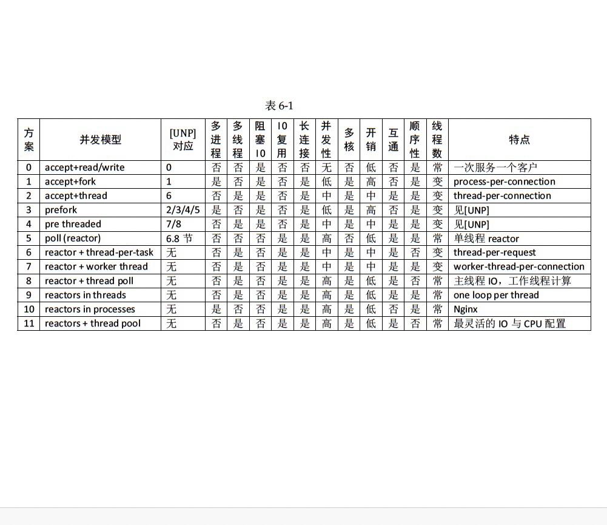

### 6.6.2. 常见的并发网络程序设计方案

开局一张图

- 方案0: iterative-server.
    - pros: 简单。
    - cons: 无并发处理能力。彻底不考虑。
- 方案1/2: accept + process/thread(prcess/thread per connection)
    - 这两个合并，方案一起说。
    - pros：整体来说还是设计简单，并且可以利用多核能力。
    - cons: 这个是要看场景。
        - 如果并发非常高，不适合。最大并发数受系统资源数限制。
        - 如果计算的开销低于IO，不适合。thread ctor/dtor的开销无法忽视。不适合 IO 密集，适合计算密集。
- 方案4/5: accept + prefork/prethread
    - 这个就是预处理的方案，池化。减少thread ctor/dtor的开销。
    - 优点：同方案 1/2并且优化了前者的问题。
    - 缺点：chenshuo在muduo里没有详细讨论。